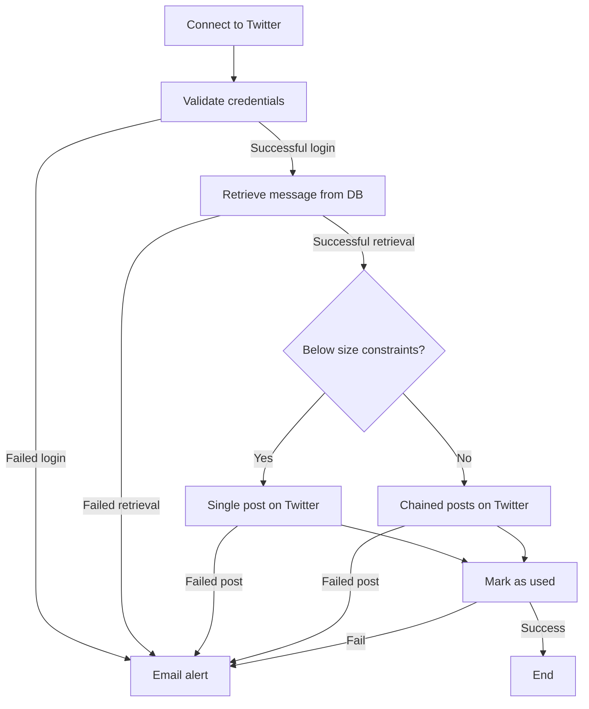

# Interesting Ukraine
https://twitter.com/UkraineInterest

#### 🤖 What? 
This python script powers the 'Ukraine is interesting' bot, which publishes an interesting aspect about Ukraine every day.

#### 🤔 Why? 
Many people have come to learn about Ukraine due to the Russian invasion. Unfortunately, much of what makes Ukraine such a rich country and nation is not being publicized. This bot aims to provide interesting facts that help raise people's awareness of Ukraine's rich history, geography, and culture.

#### 🔎 How?
1. Uses the [python-twitter library](https://pypi.python.org/pypi/python-twitter) to connect to Twitter's API with the credentials of the 'Ukraine is Interesting' user.
2. Retrieves a random message from the facts.db SQLite3 database, amongst those messages that have been posted the least.
3. Posts the message (optionally, with media) on Twitter. If the message is above the character limit, it breaks it into multiple posts.
4. Marks the message as used in the local database.

#### 😕 4 steps is too many! Can you show it with a needlessly long chart?
Sure can.


#### 💪 Features
- Supports for messages that include multiple images.
- Supports entering a special character (e.g. '|') to forcefully separate tweets for better legibility.
- Sends an email alert if the Twitter login, Twitter posting or database management fails. This is so that it can run server-side without proactive monitoring.
- Cycles randomly through messages in the database of facts, aiming to minimize the number of duplicate posts.
- If if finds an error uploading a tweet, it will retry 2 additional times with new messages before giving up and notifying you.
- Logs activity in debug.log with a rotating log file, in case you need to debug a failed post.

#### 👍 About helping with new facts
Thanks! The easiest way to go about it is to contact me (albionx@gmail), telling me the fact. Bonus points if you already phrase it in Twitter's punchy way, and include a beautiful image to go along with it. Thanks! 😄

#### 🫵 About repurposing this bot
Feel free to use this code to power another bot of your choice. 
1. Create an App on Twitter's developer portal and obtain the consumer api key and secret as well as the access token and secret. Make sure the access token and secret are created with Read & Write permissions.
2. Create a credentials.py file populating those values, using the following var names: consumer_key, consumer_secret, access_token_key, access_token_secret. For example:
```
consumer_key = 'foobar'
consumer_secret = 'foobar'
access_token_key = 'foobar'
access_token_secret = 'foobar'
```
3. If you don't want email alerts, you can set the 'emailAlert' constant to False. Else, leave it as True, and review the code in systemlog.py to provide credentials. I recommend creating a 'app password' on your Google account, which should give you a unique password to use only for this script.
4. Empty the facts.db and place whichever information you want. Don't modify the schema unless you are willing to touch the code as well.
5. Make the script run server-side on Cron, on your favorite VPS.

Please respect Twitter's ToS.

#### 🪲 Known issues and next steps
- None

#### 🧪 Testing helpers
The script accepts two invokation parameters for the sake of testing:
1. ``` python run.py badcredentials ```: Runs the script with intentionally bad credentials. Should trigger a handled error and, if emailAlert = True, should generate an email notification.
2. ``` python run.py notweet ```: Runs the script without actually posting the message on Twitter, and without registering its usage on the database.

#### 📧 Who is behind this?
* Santiago Andrigo: Master of bits and bytes - albionx@gmail.com
* Vira Baranosvka-Andrigo: Ukraine connaiseur, researcher and beautiful thing